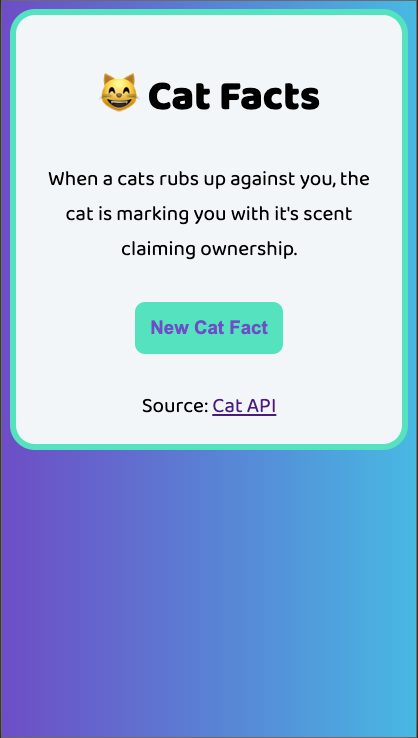
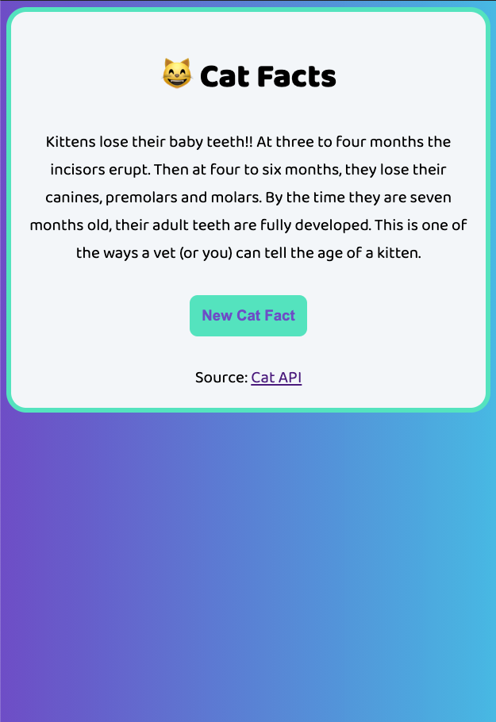
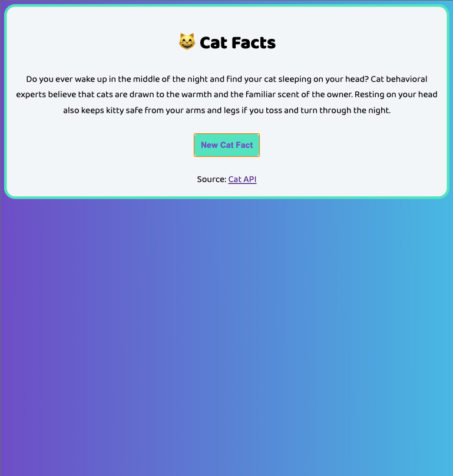

# Project - Cat Facts Generator
**Author:**     Jessica Cassidy

## Description: 
The Cat Facts application generates a random cat fact. The facts are sourced via the cat-facts Application Programming Interface (API) created by Alex Wohlbruck (Source: [cat-facts API](https://alexwohlbruck.github.io/cat-facts/)).

**Input:**      
None

**Output:**     
Page displays a random cat fact when application is loaded, refreshed, or when the "New Cat Fact" button is clicked by a user.

## Program Output Example:
\
\

