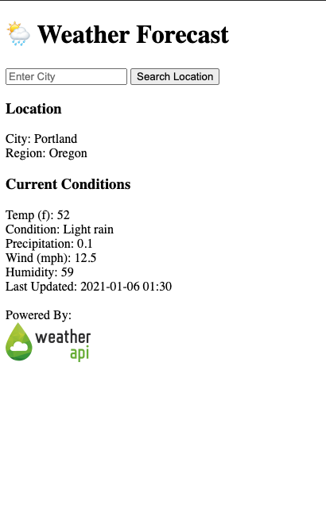

# Project - Weather Forecast
**Author:**     Jessica Cassidy

## Status: 🚧 Project in Progress 🚧
**Last Updated:** 1/6

**Current Issues:**
- [ ] Trying to assign city and API key to variables and pass to apiUrl, get error 401 but when entered directly into apiUrl, data runs fine. My plan is to eventually hide the API. For now, I am removing API key before commiting code to public repo on GitHub. 
- [ ] Search function not working. Whatever city the user inputs, it is stored in the inputCity variable. I then need to pass this info to the name variable when JSON object 'name' is destructured?

**Future Updates:**
- [ ] Hide API key - My plan is to eventually hide the API key after learning how. For now, I am removing API key before commiting code to public repo on GitHub.
- [ ] For the location search function, I want to implement the a location API via a dropdown menu, possibly use Google Places API. 
- [ ] Check if there is an option to add data on expected rainfall for the day? If not, switch to another API? 
- [ ] Add text warnings for incoming rainfall within the next hour. 
- [ ] Add styling to application.

## Description
The Weather Forecast application generates current conditions based on a city search. The weather data is sourced via the [Weather API](https://www.weatherapi.com/).

**Input:**      
Enter City

**Output:**     
Location
- City:
- Region:

Current Conditions
- Temp (f):
- Condition:
- Precipitation:
- Wind (mph):
- Humidity:
- Last Updated:
## Program Output Example:

