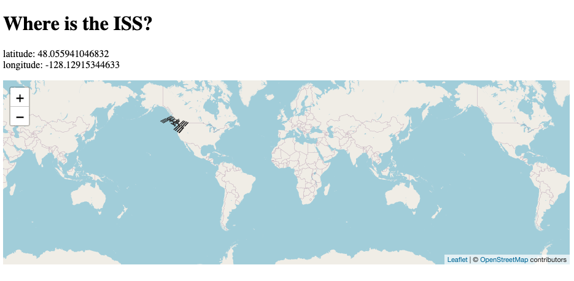
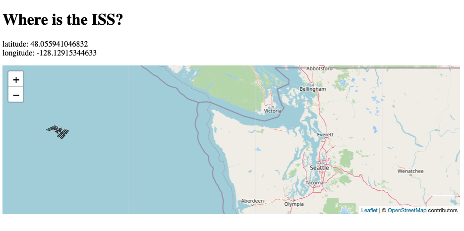

# Program - ISS Location 

## Description: 
This was a server-side API tutorial exercise on 
[YouTube by Code Train](https://www.youtube.com/watch?v=tc8DU14qX6I&list=PLRqwX-V7Uu6YxDKpFzf_2D84p0cyk4T7X&index=3). 
The goal was to fetch the current location of the International Space Station using an API online: 
[Where The ISS At?](https://wheretheiss.at/). The [Leaflet.js Library](https://leafletjs.com/) was used to create a map and icon to plot current ISS location. 

**Input:**      
None

**Output:**     
Displays current ISS location on a map via latitude and longitude. 

## Program Output Example:
\
\