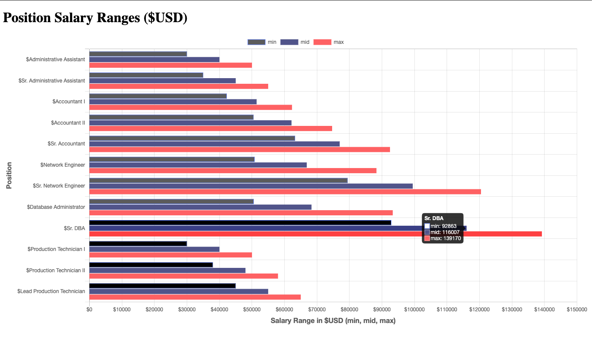
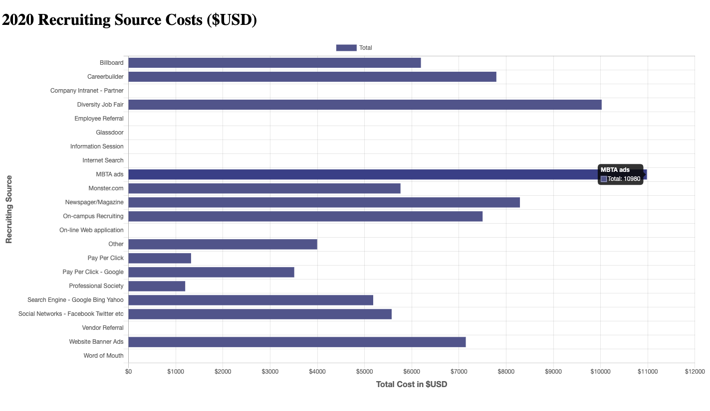

# Program - HR Analytics Dashboard 

## Status (Last Updated - 12/31/20):
Project in progress. 
- Position Salary Ranges ($USD) -- Complete
- 2020 Recruiting Source Costs ($USD) -- Complete
- Total Headcount by Department -- Started
- Average Tenure
- Employee Satisfaction Score

## Description: 
Using a data set from [AIHR Analytics](https://www.analyticsinhr.com/blog/hr-data-sets-people-analytics/), the HR Analytics dashboard presents people data in several charts and graphs: 

**Input:**      
None

**Output:**     
..

## Program Output Example:
**Position Salary Ranges ($USD):**\

**2020 Recruiting Source Costs ($USD):**\

