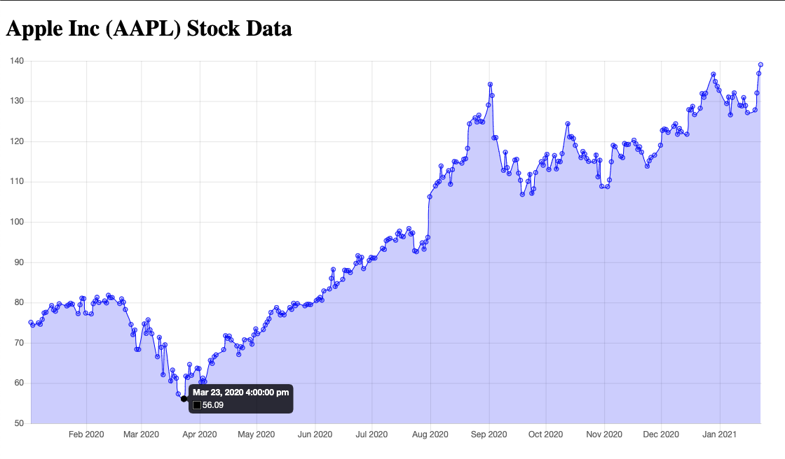

# Program - Stock Chart Data (CSV Data)

## Description: 
This was a community college assignment exercise involving generating a csv of stock data, node.js, and plotting it via a chart using the chart.js library. 

**Input:**      
None

**Output:**     
Displays fetched data from a local .csv file.

## Program Output Example:

