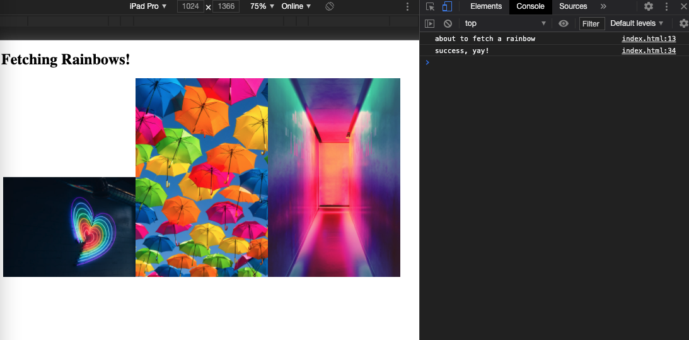

# Program - Fetching Rainbow Images (Client-side)

## Description: 
This was a Client-side API tutorial exercise on [YouTube by Code Train](https://www.youtube.com/watch?v=tc8DU14qX6I&list=PLRqwX-V7Uu6YxDKpFzf_2D84p0cyk4T7X&index=3). The goal was to fetch an array of images using fetch, async, and await. 

**Input:**      
None

**Output:**     
Displays images that were fetched via the client-side.

## Program Output Example:
