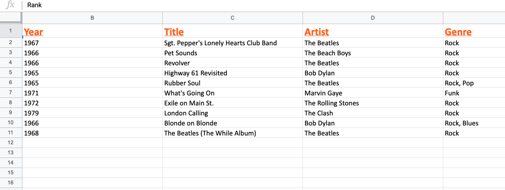

# Program - Exceljs Practice (Excel Data in .xlsx)

## Description: 
This was an exercise practicing using Exceljs via NPM and Node.js to render a .xlsx workbook via the manipulation of JSON data. 

**Input:** None

**Output:**     
- Displays JSON data in excel spreadsheet format.\
- Data Source: https://raw.githubusercontent.com/Currie32/500-Greatest-Albums/master/albumlist.csv

## Program Output Example:
