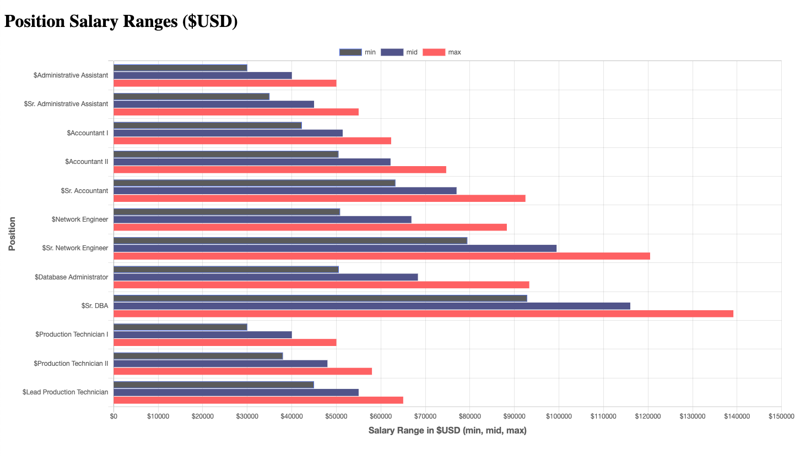

# Program - HR Analytics Dashboard 

## Status (Last Updated - 12/30/20):
Project in progress. 
- Position Salary Ranges ($USD) -- Complete
- Recruiting Costs -- In Progress

## Description: 
Using a data set from [AIHR Analytics](https://www.analyticsinhr.com/blog/hr-data-sets-people-analytics/), the HR Analytics dashboard presents people data in several charts and graphs: 
- Position Salary Ranges ($USD)
- Recruiting Costs
- Headcount by Department, Employee Type, and Gender
- Salary by Age Group & Gender
- Average Tenure

**Input:**      
None

**Output:**     
..

## Program Output Example:
**Position Salary Ranges ($USD):**\

