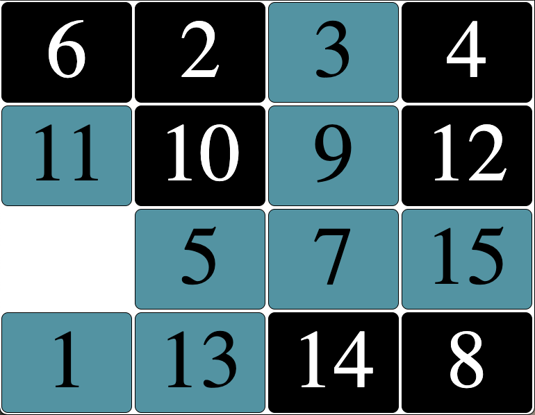
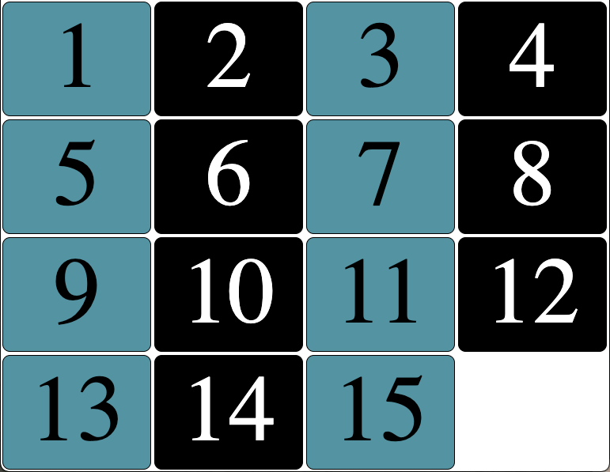

# Porgram - 15 Slider Puzzle

## Description: 
Using jQuery, the puzzle generates 15 shuffled tiles that you can move around using your arrow keys (right, left, up, and down). The goal is to solve the puzzle by putting the tiles in order, left to right. Only one blank space is available to shuffle around. This was an exercise done in my JavaScript community college course.

**Input:**      
None

**Output:**     
Displays 15 shuffled tiles that you can slide right, left, up, or down to solve the puzzle. 

## Program Output Example:
Shuffled:

Solved:
