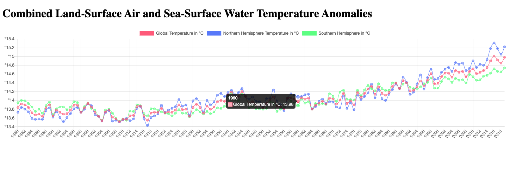

# Program - API Fetch Data - Combined Land-Surface Air and Sea-Surface Water Temperature Anomalies

## Description: 
Tutorial project exercise from Code Train YouTube Tutorials on ["Working w/ Data & API's"](https://www.youtube.com/playlist?list=PLRqwX-V7Uu6YxDKpFzf_2D84p0cyk4T7X). Used a data set .csv file from NASA on [Land-Surface Air and Sea-Surface Water Temperature Anomalies](https://data.giss.nasa.gov/gistemp/) and fetched that data locally via the client-side. After fetching successfully, the data was handled via a line chart, using the [Chart.js](https://www.chartjs.org/) library. 

**Input:**      
None

**Output:**     
Displays fetched data from a local .csv file.

## Program Output Example:

