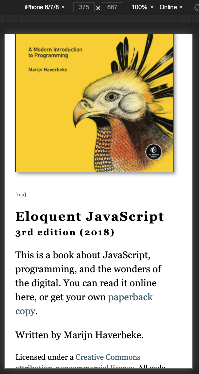
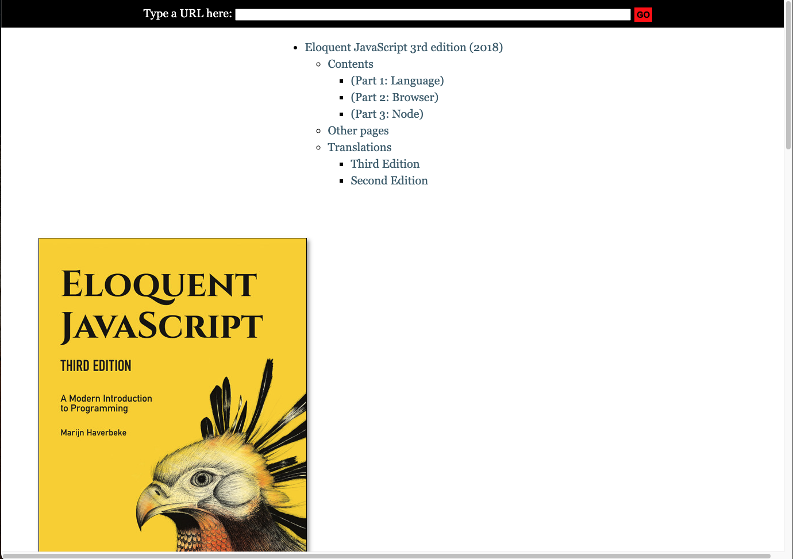
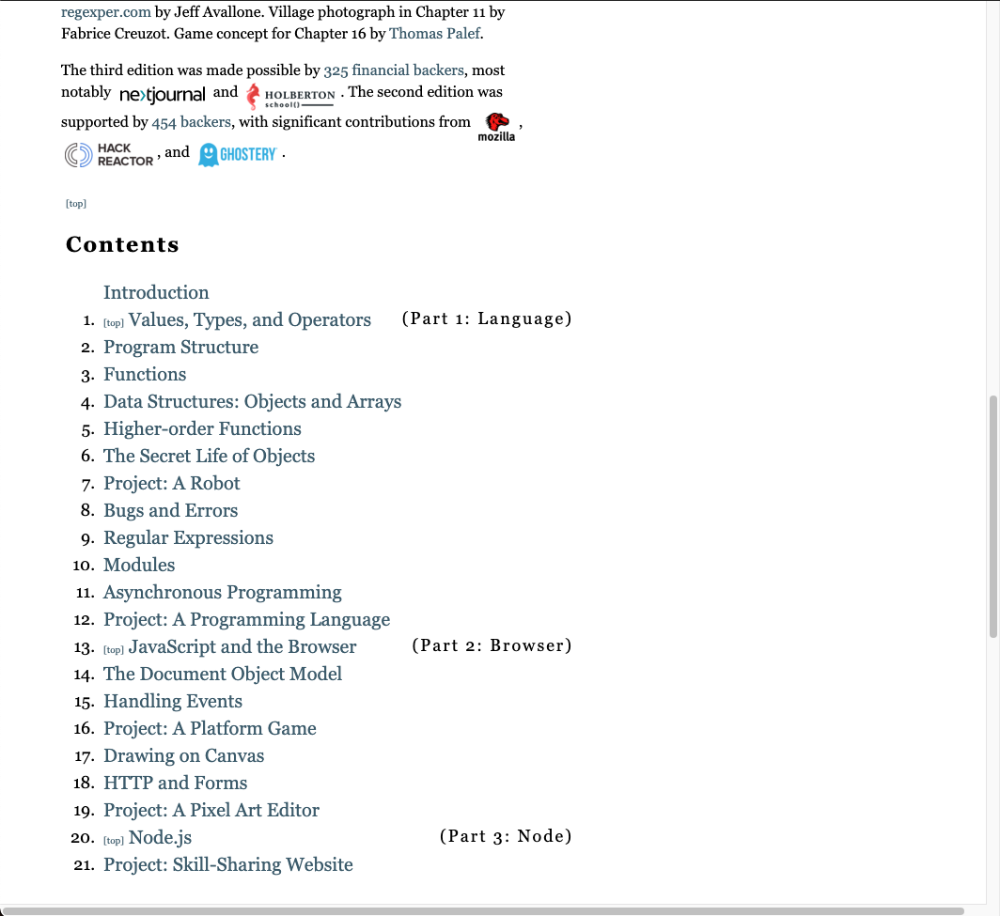
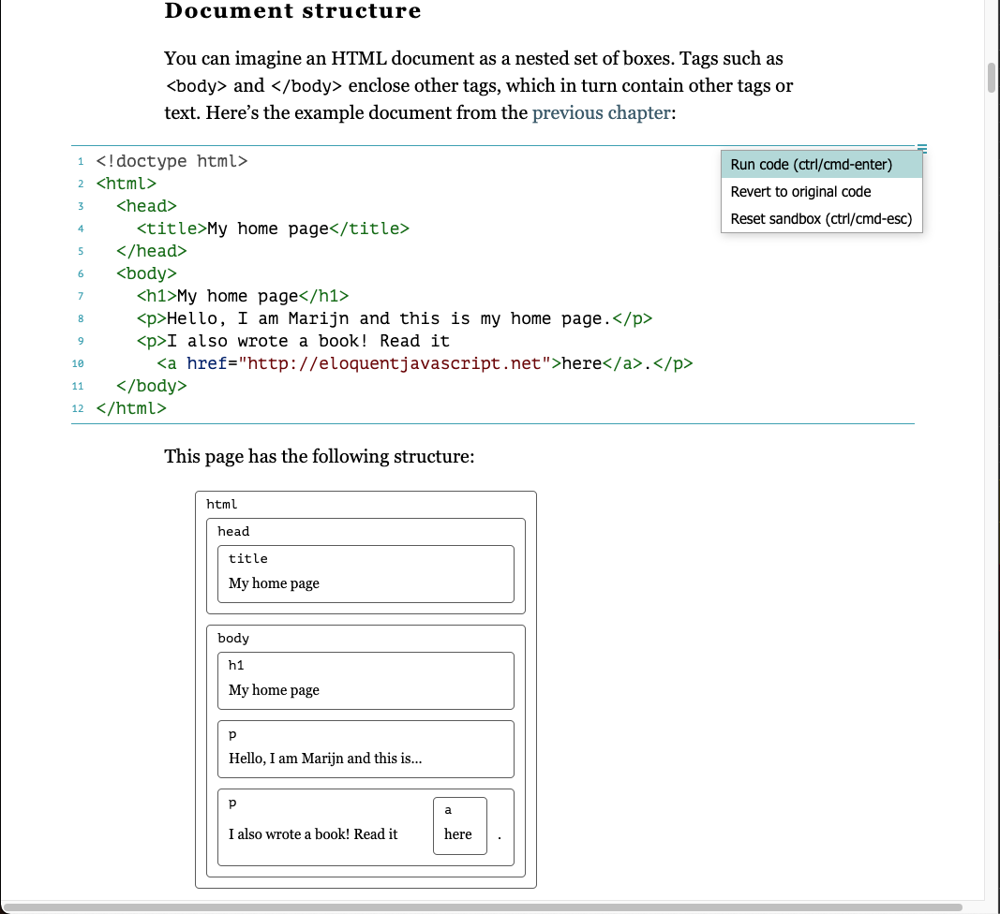
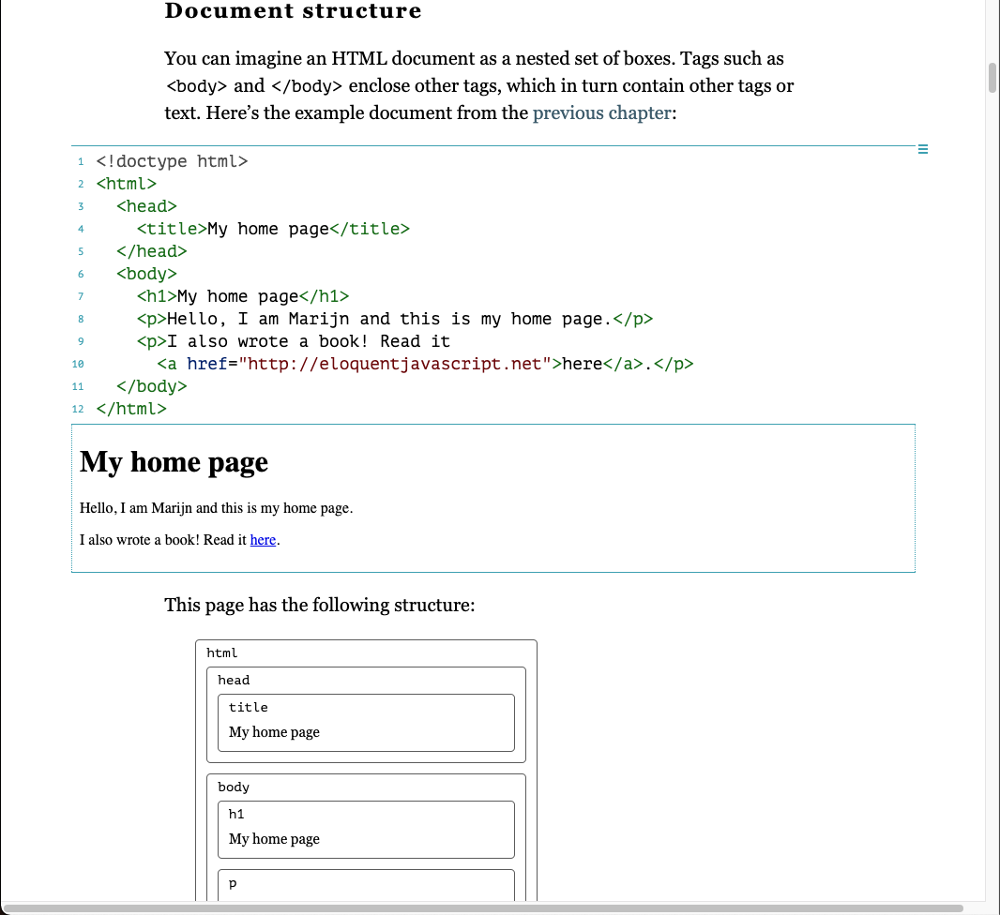
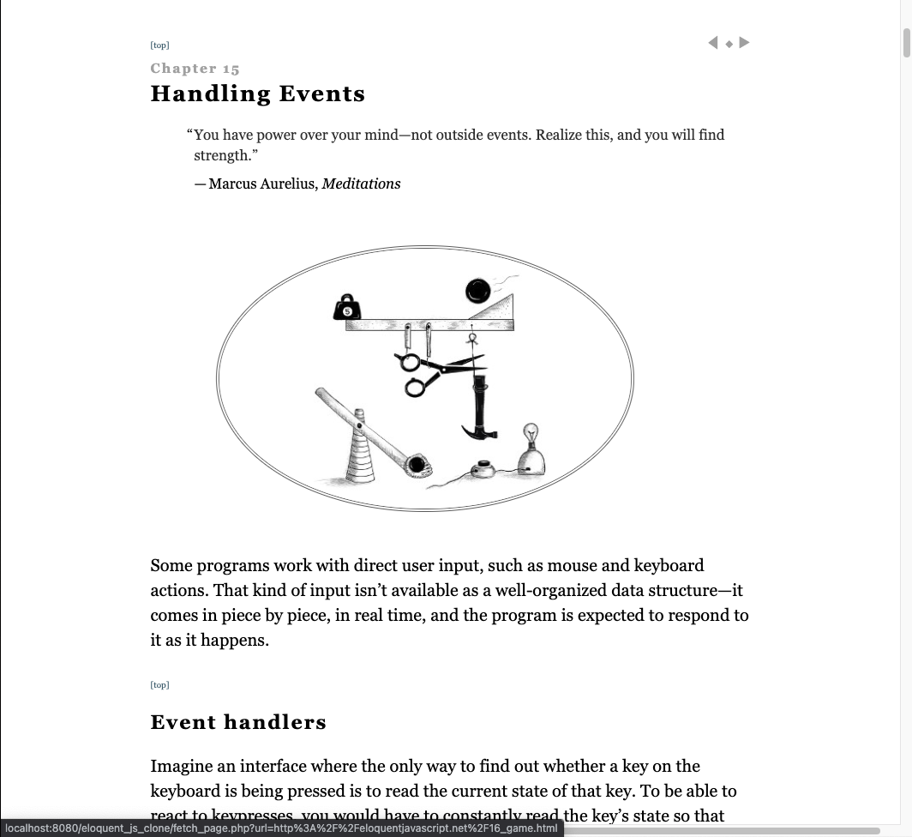

# Program - Eloquent JavaScript Clone

## Description: 
Using some PHP and Javascript, the Eloquent JavaScript Clone fetches information from the original book website. This was a tutorial exercise done in my JavaScript community college course.

**Input:**      
None

**Output:**     
Displays fetched data from the Eloquent Javascript book  website: http://eloquentjavascript.net/.

## Program Output Example:
\
\
\
\
\

