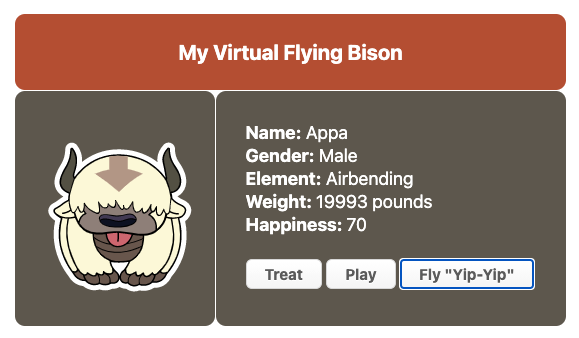

# Program - Virtual Pet

## Description: 
This is a virtual pet exercise I did as part of a meetup webinar. 

**Input:**      
User selects from 3 command buttons: (1)Treat, (2)Play, (3)Fly

**Output:**     
Weight and happiness fluctuate depending on how many times button commands were pressed.

## Program Output Example:

