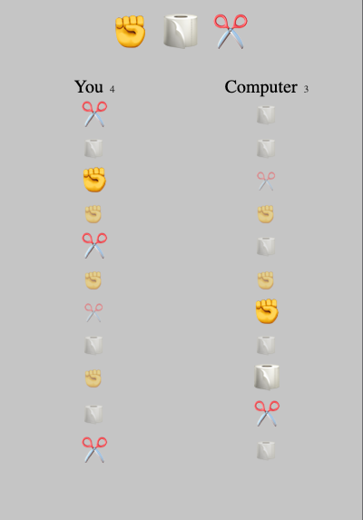

# Program - Rock, Paper, Scissors

## Description: 
This is an excercise I followed on YouTube. User is against a random generator and competes by selecting from rock, paper or scissors.\
Youtube Tutorial Source: https://www.youtube.com/watch?v=1yS-JV4fWqY&t=896s

**Input:**      
User selects from rock, paper, or scissors. 

**Output:**     
Score is tallied between User (You) and Computer.

## Program Output Example:

