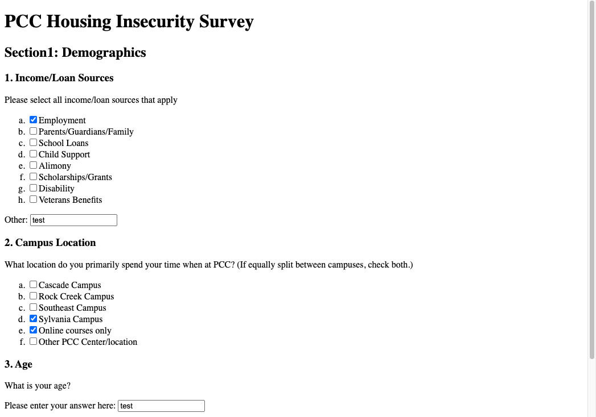
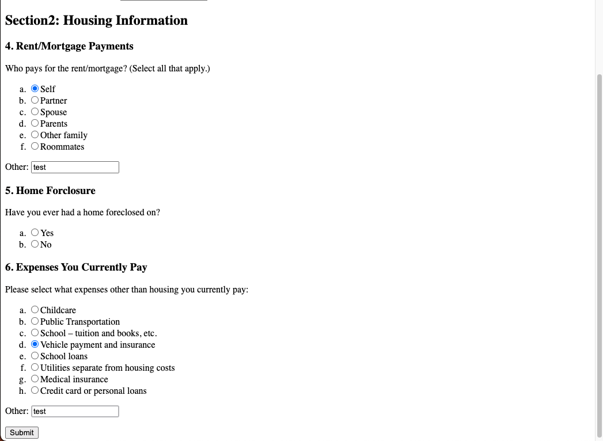

# Program - PCC Housing Insecurity Survey

## Description: 
This was a static survey exercise done in my JavaScript community college course.

**Input:**      
User selects or inputs data.

**Output:**     
None. Survey does not have an active submit feature. 

## Program Output Example:

