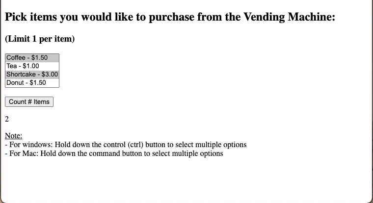

# Program - Vending For Loop 
**Author:**     Jessica Cassidy\
**Date:**       October 25, 2020

## Description: 
This program counts the number of items a user selects. This was a Javascript program I created in my Javascript community college course to practice using the for loop. 

**Input:**      
User selects 0 - 4 items max.

**Output:**     
Displays the total item count. 

## Program Output Example:

